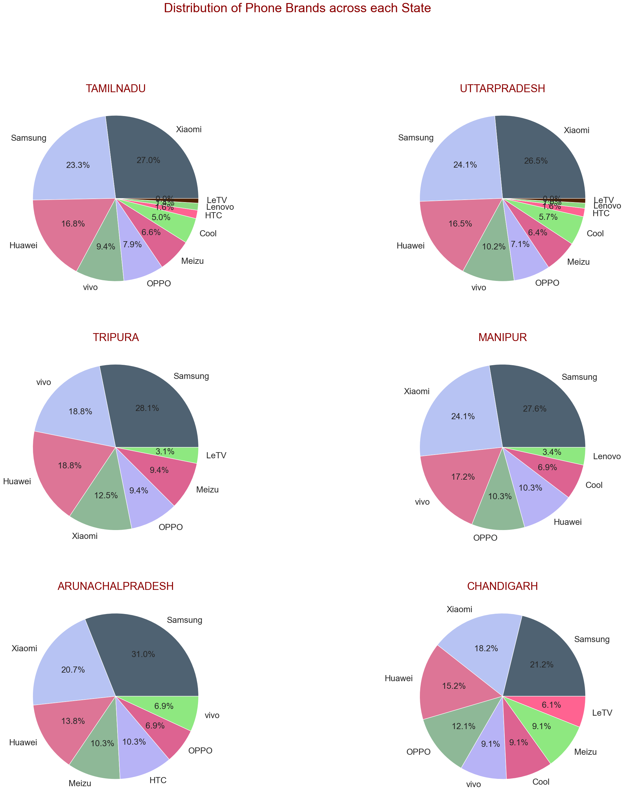

# Telecom-EDA

To analyze more than 3 million events to improve the quality and consistency of the data.
The company realizes that study of user’s behavioural patterns of network usage in the past could benefit them in making informed business decisions.

The company wishes to identify the:
- Niche customer segments and their network usage pattern
- User’s preferences based on the gender, age and demographic details
- Mobile usage habits
- Device feature preferences
- Market share in the different parts of the country
- Growth opportunities

